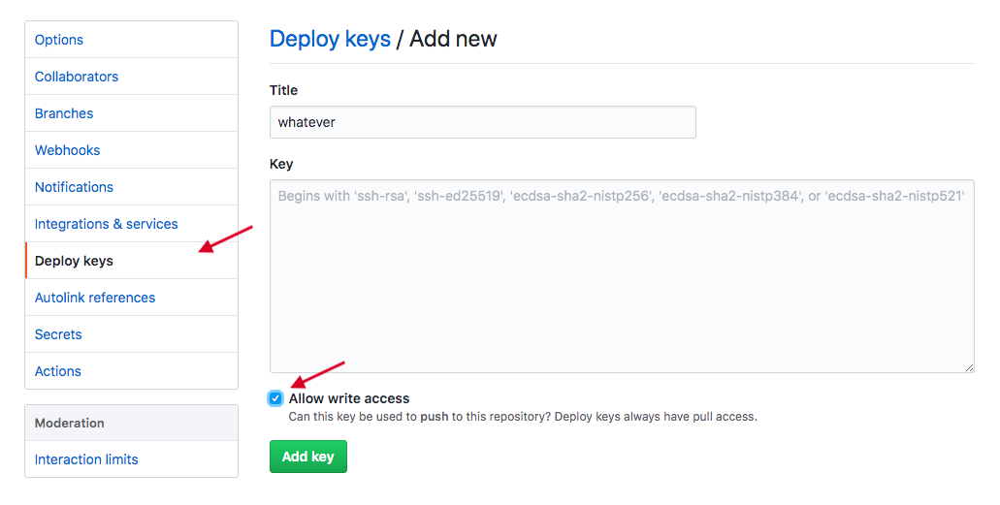
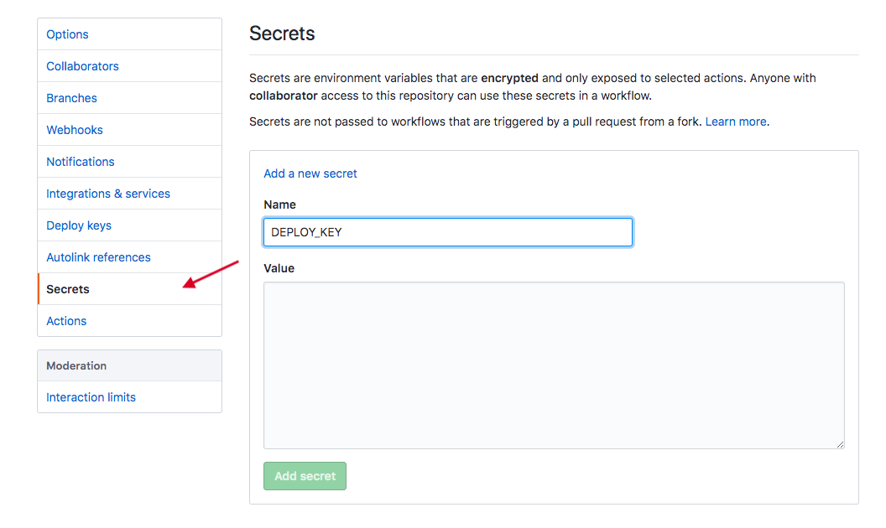

# hackday-site
A single page site using react. It contains a survey. Uses the awesome [Parcel.js](https://parceljs.org/) to obviate all thinking.

## Install and deploy process

1. `npm install`
2. `npm start` for some deving.
3. Update the URL in `js/Survey.js` to send your submits wherever. (I'm using [formspree.io](https://formspree.io))
4. (this is annoying) Create a deploy key for your repo: 
    1. Run:
        ```ssh-keygen -t rsa -b 4096 -C "youremailhere@example.com" -N "" -f deploykey```
    2. Create a new Deploy Key, it doesn't matter what you call it, and paste the content of `deploykey.pub` into the box. Be sure to click *Allow Write Access*. 
            
    3. Now create a new secret called `DEPLOY_KEY`, and paste the private key into that box. 
            
        
    Why is this required? Because `GITHUB_TOKEN` doesn't work. [See here](https://github.community/t5/GitHub-Actions/Github-action-not-triggering-gh-pages-upon-push/m-p/31266).
    
4. `git push origin master` (this also deploys to `gh_pages` using `JamesIves/github-pages-deploy-action`)
5. Turn on Github Pages by choosing the `gh_pages` publishing source. ([docs](https://help.github.com/en/github/working-with-github-pages/configuring-a-publishing-source-for-your-github-pages-site))

Yay your site is live at `https://github.com/username/repo`!
